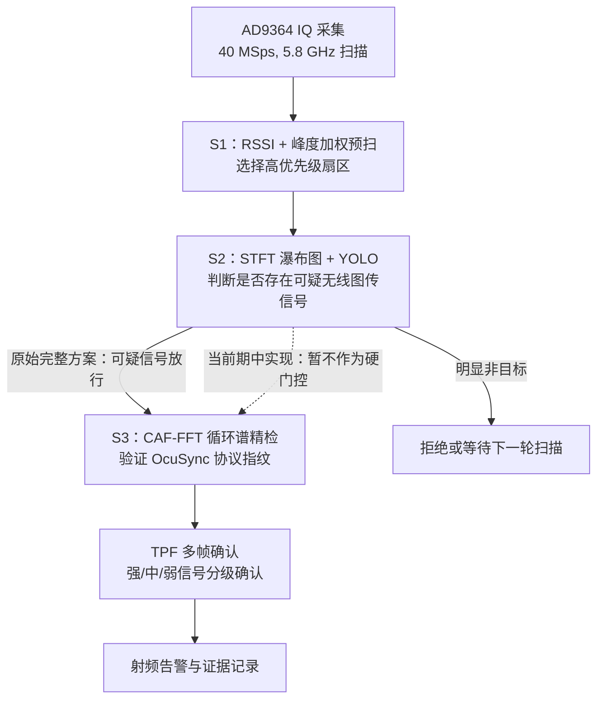
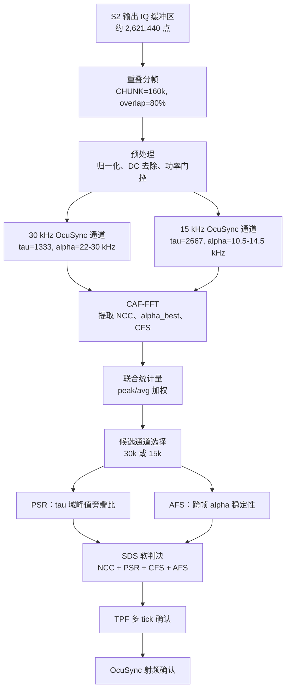
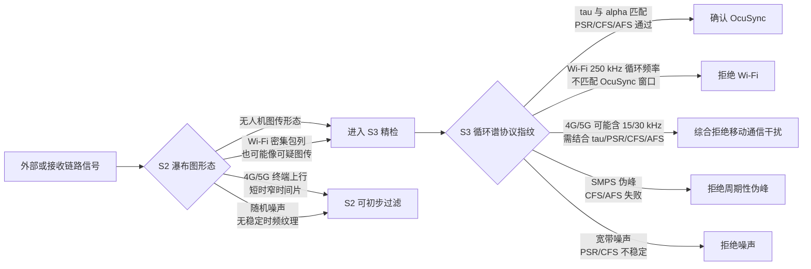

# 无人机射频识别部分中期技术报告

## 摘要

本文围绕低空无人机目标的**射频识别**问题展开，面向 5.8 GHz 频段内 DJI OcuSync 类无人机图传与遥控链路，构建基于软件无线电采集、时频图像筛选与循环谱协议指纹确认的分层检测方法。相较于传统能量检测仅依据接收功率升高进行判别的方式，本文所述方案将射频识别过程划分为三个层次：**候选频段发现、频谱形态筛选、协议物理指纹确认**。原始方案采用 **S1-S2-S3 三级级联结构**：S1 负责快速扫频与候选扇区排序，S2 负责将 IQ 信号转换为频谱瀑布图并进行可疑无线图传信号筛选，S3 则对 S2 放行的候选信号执行循环谱精检，以确认其是否满足 **OcuSync 协议指纹**。

截至期中节点，系统已完成三级模块的核心验证工作。S1 实现了基于 **RSSI 与峰度加权**的快速扇区预扫；S2 实现了 IQ 到 **STFT 频谱瀑布图**的生成、YOLOv8n 训练与推理输出；S3 实现了基于 **CAF-FFT 的循环平稳特征检测**，并引入 **NCC、PSR、CFS、AFS、SDS 与 TPF** 等组合判决机制。受阶段开发周期限制，现阶段实现暂时简化了 S2 与 S3 之间的调度关系，即 **S2 暂未作为进入 S3 的硬门控条件**，而主要承担频谱可视化与 YOLO 置信度辅助功能；**S3 承担主要协议指纹确认任务**，以优先保证射频识别主处理链路的功能闭环与可靠性。

需要特别说明的是，**S2 的功能定位并非最终确认无人机，而是筛选“可疑无线信号”**。Wi-Fi 与无人机图传同属宽带数字通信信号，在高流量条件下可在频谱瀑布图中呈现连续或密集突发的时频纹理，因此 **Wi-Fi 具有较高概率通过 S2 的 YOLO 可疑信号判断**。据此，系统有必要设置 **S3 循环谱精检层**，利用 OcuSync 特有的**符号周期、循环前缀、循环频率、目标延迟峰和帧间稳定性**，将无人机图传信号与 Wi-Fi、4G/5G、开关电源谐波以及宽带噪声等非目标信号区分开来。

## 1. 研究背景与射频识别目标

随着低空无人机在航拍、巡检、物流和公共安全等场景中的广泛应用，针对无人机目标的探测、识别与预警逐渐成为低空安全管理中的重要问题。无人机探测可采用光学视觉、雷达、声学、射频等多种技术路线。其中，射频识别方法能够直接感知无人机与遥控器之间的通信链路，在目标尚未进入光学视野、目标尺寸较小、光照条件不佳或存在视觉遮挡的情况下，仍具备较高的早期发现价值。

本项目聚焦的射频对象为 **5.8 GHz 频段内的无人机图传与控制信号**，尤其是 **OcuSync 类 OFDM 通信链路**。无人机图传链路通常承担实时视频与控制信息传输任务，因而在观测窗口内往往表现出较高时间占用率、相对稳定的带宽占用、特定 OFDM 符号结构以及较稳定的协议周期特征。这些特征可分别在两个层面体现：一是在频谱瀑布图中表现为**时频形态特征**，如信号持续时间、带宽占用、突发纹理和频率轨迹；二是在物理层统计结构中表现为**循环平稳特征**，如循环前缀、符号周期和循环频率峰值。

传统能量检测方法仅判断某一频段内接收功率是否升高，易受 Wi-Fi、4G/5G、宽带噪声、开关电源谐波及接收机伪迹影响。在宿舍、实验室或城市环境中，5 GHz 附近通常存在大量无线通信设备，仅凭 RSSI 难以可靠判定信号来源。因此，本项目并未将“功率增强”作为最终识别依据，而是采用三级递进式处理链路：首先发现可能存在目标活动的候选频段，其次判断该频段中的时频形态是否可疑，最后利用循环谱验证其协议指纹。

## 2. 原始总体方案：S1-S2-S3 三级级联流水线

原始设计中，射频识别链路被设计为完整的三级级联流水线：

图 1 S1-S2-S3 三级级联射频识别流水线

**S1 的目标是解决候选频段选择问题**。系统在 5745 MHz、5785 MHz 和 5825 MHz 等 5.8 GHz OcuSync 相关扇区之间快速切换，通过短时 IQ 采样估计各扇区功率，并结合**信号峰度**对低占空比突发帧进行加权，从而将后续 S2 与 S3 的计算资源集中到更可能存在无人机活动的频段。

**S2 的目标是解决可疑信号筛选问题**。S2 将 S1 选中的 IQ 数据转换为 640×640 的**频谱瀑布图**，并由 YOLO 模型判断图像中是否存在类似无人机图传的时频结构。应当指出，**S2 并不承担最终协议确认任务，而是作为候选筛选层**。其职责是过滤明显不符合无人机图传形态的信号，如极短时突发、低时间占用率移动终端上行、随机噪声或缺乏稳定时频结构的背景信号。

**S3 的目标是完成 OcuSync 协议级确认**。S3 不再依赖频谱图像外观，而是转向 IQ 数据的物理层统计结构，计算**循环自相关与循环谱**，寻找 OcuSync OFDM 结构对应的稳定循环频率峰。**S3 是最终确认层**，用于剔除 Wi-Fi 等可能通过 S2 可疑判断但并不具备 OcuSync 协议指纹的干扰信号。

该分层设计具有明确的工程意义：S1 保证扫描实时性，S2 降低无意义精检次数，S3 保证物理层识别可靠性。期中阶段受开发时间限制，现有实现优先保证 S1 与 S3 主链路可靠运行，S2 暂作为辅助评分与可视化模块；后续工作将恢复完整的 S2 门控调度关系。

## 3. S1：基于 RSSI 与峰度加权的快速候选扇区扫描

S1 是射频识别流水线的入口模块，其主要任务是在多个候选中心频率之间快速切换，采集短时 IQ 数据，估计各扇区的平均功率，并输出当前最值得进一步分析的候选频段。当前系统配置的候选中心频点包括 5745 MHz、5785 MHz 和 5825 MHz，采样率为 40 MSps。

若仅使用平均功率作为排序依据，则低占空比突发信号存在被低估的风险。无人机图传信号并不必然持续满功率发射，其短时峰值可能较高，但平均功率可能被噪声底稀释，从而导致传统 RSSI 排序无法优先选择该扇区。为缓解这一问题，S1 引入峰度加权机制。峰度用于刻画信号幅度分布的尖峰程度，高斯热噪声峰度约为 3，而 OcuSync 类突发帧通常具有更高峰度。

功率估计与峰度可表示为：

$$
P_f=\mathbb{E}\{|x_f[n]|^2\}
$$

$$
\kappa_f=\frac{\mathbb{E}\{|x_f[n]|^4\}}{\left(\mathbb{E}\{|x_f[n]|^2\}\right)^2}
$$

峰度加权后的扇区评分为：

$$
\tilde{P}_f=\bar{P}_f\left(1+\beta\cdot\frac{\max(\kappa_f-3,0)}{3}\right),\quad \beta=0.40
$$

其中，$\bar{P}_f$ 表示经 EMA 平滑后的功率估计，$\kappa_f$ 表示信号峰度，$\beta$ 为峰度权重系数。该设计使热噪声不会获得额外加权，而具有明显突发特征的信号可获得更高排序优先级。工程实现中进一步采用 3 帧中值估计与 EMA 平滑，以降低偶发 Wi-Fi 包或瞬时脉冲噪声对扇区排序的影响。

S1 的输出并非告警结果，而是候选扇区排序。其功能边界应表述为“确定优先分析频段”，而非“判定无人机存在”。

## 4. S2：频谱瀑布图与 YOLO 可疑信号筛选

S2 接收 S1 选出的候选频段，在该频段上执行较长时间窗 IQ 采样，并将复数 IQ 序列转换为二维时频图像。当前每次 S2 采集约 2,621,440 个采样点，对应约 65 ms 时间窗口。系统使用 STFT 将时域信号转换为频域能量分布，再映射为 640×640 的 VIRIDIS 伪彩色瀑布图，作为 YOLOv8n 模型输入。

S2 的时频变换可表示为：

$$
X(m,k)=\sum_{n=0}^{N-1}x[n+mH]\,w[n]\,e^{-j2\pi kn/N}
$$

其中，$N$ 为 FFT 点数，$H$ 为 hop size，$w[n]$ 为 Blackman 窗。瀑布图像素强度由 STFT 幅度谱的对数映射获得：

$$
P(m,k)=20\log_{10}\left(|X(m,k)|+\epsilon\right)
$$

S2 的原始定位是**可疑信号筛选层**。具体而言，S2 不需要精确区分所有通信协议，而是判断当前频段是否存在值得 S3 深入分析的无线图传类信号。对于明显短暂、零散或缺乏稳定带宽占用的信号，S2 可进行初步过滤；对于具有持续时频纹理、宽带占用或疑似无人机图传结构的信号，**S2 将其放行至 S3**。

在干扰分析中，4G/5G 与 Wi-Fi 的表现需区别讨论。4G/5G 终端上行信号通常由基站调度，资源块分配具有短时突发特征，在瀑布图上可能仅占据较窄时间片。对于此类信号，S2 可利用时间持续性、连通区域长度、带宽占用形态和时频纹理进行初筛。

然而，**Wi-Fi 的干扰特性有所不同**。Wi-Fi 与无人机图传同属宽带数字通信信号，在高流量环境中可能呈现密集突发包列，甚至在瀑布图上形成较长时间连续纹理。YOLO 从图像角度观察到的是宽带无线通信形态，因此可能将 Wi-Fi 判定为可疑无线信号。据此，**S2 不应被描述为可可靠排除 Wi-Fi 的最终识别层**。更准确的表述是：**S2 倾向于放行可疑信号以降低漏检风险，最终协议确认交由 S3 完成**。

现阶段实现中，S2 已完成瀑布图生成、YOLO 训练和置信度输出。训练数据以 RFUAV 无人机 IQ 录制为正样本，并加入合成 AWGN 负样本；现有文档和脚本中尚未体现专门的 Wi-Fi、4G 或 5G 负样本库。因此，现阶段 S2 已具备频谱图可疑信号检测能力，但对 Wi-Fi 等相似宽带通信信号仍可能放行，这进一步说明 S3 协议指纹确认层具有必要性。

## 5. 循环谱检测无人机协议特征的理论依据

循环谱检测的理论基础是**循环平稳性**。普通随机噪声的统计特性通常不随时间呈现稳定周期结构，而数字通信信号由于**符号周期、循环前缀、导频、帧结构或重复调制机制**，会在二阶统计量中表现出周期性。该周期性未必在普通功率谱中显著，但可通过循环自相关函数和循环谱体现。

对于 OFDM 信号，**循环前缀**是关键结构。发送端将每个 OFDM 符号尾部的一段复制到符号前端，以抵抗多径传播引起的符号间干扰。该复制结构意味着，在特定延迟 $\tau$ 下，信号片段与其延迟版本之间存在相关性：

$$
z[n]=x[n]\cdot x^*[n-\tau]
$$

对该延迟乘积序列进行 FFT，即可在对应循环频率 $\alpha$ 上观察到峰值。更一般地，循环自相关函数可表示为：

$$
R_x^{\alpha}(\tau)=\lim_{T\rightarrow\infty}\frac{1}{T}\int_{-T/2}^{T/2}
x(t+\tau/2)x^*(t-\tau/2)e^{-j2\pi\alpha t}\,dt
$$

离散实现中，系统首先构造延迟乘积序列：

$$
z_{\tau}[n]=x[n]\cdot x^*[n-\tau]
$$

随后通过 FFT 在循环频率轴上搜索循环相关峰：

$$
S_x(\alpha,\tau)=\left|\operatorname{FFT}\{z_{\tau}[n]\}\right|
$$

归一化循环相关峰 NCC 定义为：

$$
\operatorname{NCC}(\alpha,\tau)=
\frac{\left|\sum_n x[n]x^*[n-\tau]e^{-j2\pi\alpha n/F_s}\right|}
{N_{\tau}\cdot P_x+\epsilon}
$$

其中：

$$
P_x=\frac{1}{N}\sum_{n=0}^{N-1}|x[n]|^2
$$

OcuSync 类信号具有相对稳定的 OFDM 符号结构。**本系统现阶段针对 OcuSync 建立 30 kHz 和 15 kHz 两类检测假设**，并分别设置目标延迟和循环频率搜索窗口。30 kHz 通道关注约 22-30 kHz 的循环频率范围，15 kHz 通道关注约 10.5-14.5 kHz 的循环频率范围。实测中多次出现约 27.99 kHz 的稳定循环频率峰，该现象与 OcuSync OFDM 符号结构相吻合，因此可作为协议指纹证据。

子载波间隔与目标延迟的近似关系为：

$$
\tau_{\Delta f}\approx \frac{F_s}{\Delta f}
$$

在 $F_s=40$ MSps 时：

$$
\tau_{30k}\approx \frac{40\times10^6}{30\times10^3}\approx 1333
$$

$$
\tau_{15k}\approx \frac{40\times10^6}{15\times10^3}\approx 2667
$$

循环谱检测的优势在于，其判据并非“是否存在能量”，而是“是否存在符合目标协议结构的周期相关性”。因此，即便某一干扰信号功率较强，只要其周期结构、目标延迟峰、循环频率集中度和帧间稳定性不符合 OcuSync，仍不应被判定为无人机。

## 6. S3：循环谱协议指纹确认

**S3 是现阶段系统中的核心协议确认层**，也是本方案区别于普通频谱检测的关键部分。S1 和 S2 分别解决候选频段选择与可疑时频形态筛选问题，但二者均无法最终证明目标为无人机。S3 以 S2 采集得到的原始 IQ 缓冲区为输入，从通信物理层结构出发，验证信号是否具有 **OcuSync 类 OFDM 协议指纹**。

### 6.1 S3 的输入与总体处理流程

S3 输入为一段较长 IQ 采样窗口，现阶段每次由 S2 采集约 2,621,440 个采样点，对应约 65 ms 时间长度。S3 并非对整段数据进行一次性全局判决，而是将其切分为多个重叠分析帧。当前实现中，单帧长度为 160,000 点，重叠率为 80%。在 40 MSps 采样率下，160,000 点对应 4 ms 时间窗口，既可覆盖多个 OFDM 符号，又可避免无人机低占空比突发帧被过度平均。

重叠分帧设计具有两方面意义。第一，它提高了突发信号命中概率。无人机图传信号可能并非在整个 65 ms 窗口内持续存在，若仅执行长时间平均，突发帧的循环谱峰会被静默区稀释。第二，它为 AFS 提供帧间稳定性序列，使系统不仅能够判断某一帧是否存在循环谱峰，还能判断最佳循环频率在多帧之间是否稳定。

S3 处理流程可概括为：对每个分析帧执行 **IQ 归一化和 DC 去除**；在 **OcuSync 30 kHz 与 15 kHz 两条候选协议通道**上分别计算循环谱；提取峰值 **NCC**、最佳循环频率和 **CFS**；在最佳候选通道上计算 `tau` 域 **PSR** 与帧间 **AFS**；最终通过 **SDS 软判决评分**和 **TPF 多帧确认机制**输出确认结果。

图 2 S3 循环谱协议指纹确认流程

### 6.2 双通道 OcuSync 协议假设

OcuSync 不同代际与不同机型的物理层参数并非完全一致，因此 S3 不应只检测单一循环频率。现阶段系统将 OcuSync 目标划分为 30 kHz 和 15 kHz 两类子载波结构并行检测。

对于 30 kHz 类 OcuSync 信号，在 40 MSps 采样率下，目标延迟近似为：

$$
\tau_{30k}\approx\frac{40\times10^6}{30\times10^3}\approx 1333
$$

其循环频率搜索窗口设置为：

$$
\Omega_{30k}=[22\text{ kHz},30\text{ kHz}]
$$

对于 15 kHz 类 OcuSync 信号，目标延迟近似为：

$$
\tau_{15k}\approx\frac{40\times10^6}{15\times10^3}\approx 2667
$$

对应循环频率搜索窗口为：

$$
\Omega_{15k}=[10.5\text{ kHz},14.5\text{ kHz}]
$$

S3 同时计算两条通道的循环谱统计量，并选择证据更强的通道进入后续验证。该设计避免系统仅对某一代 OcuSync 或某一类机型有效。

### 6.3 CAF-FFT 与 NCC 主检测量

S3 首先计算循环相关峰。对每个分析帧，系统构造延迟乘积：

$$
z_{\tau}[n]=x[n]\cdot x^*[n-\tau]
$$

若信号存在与该 $\tau$ 对应的循环前缀或重复结构，则 $z_{\tau}[n]$ 中将保留周期性分量。对该序列执行 FFT 后，可将周期分量映射到循环频率轴：

$$
S_x(\alpha,\tau)=\left|\operatorname{FFT}\{z_{\tau}[n]\}\right|
$$

系统采用归一化循环相关峰 NCC 作为主检测量：

$$
\operatorname{NCC}(\alpha,\tau)=
\frac{\left|\sum_n x[n]x^*[n-\tau]e^{-j2\pi\alpha n/F_s}\right|}
{N_{\tau}\cdot P_x+\epsilon}
$$

NCC 的物理含义为：在目标循环频率与目标延迟处，信号周期相关强度相对于自身功率的归一化幅度。因此，即使接收功率随距离、遮挡或增益设置变化，只要协议结构仍然存在，NCC 仍可作为相对稳定的判据。

对每一帧，S3 分别在 $\Omega_{30k}$ 和 $\Omega_{15k}$ 内搜索 NCC 峰值，形成帧级峰值序列。随后系统使用峰值与均值的联合统计量：

$$
C = w_p\cdot \max_i(\operatorname{NCC}_i)+(1-w_p)\cdot \operatorname{mean}_i(\operatorname{NCC}_i)
$$

其中，现阶段取 $w_p=0.65$。峰值项用于保留突发帧中的强证据，均值项则用于抑制单帧偶然峰值对判决的过度主导。

第一层判据为 **NCC 检测**。系统分别对 30 kHz 和 15 kHz 目标通道计算循环谱峰值，并与当前扇区自校准阈值进行比较。现阶段默认硬底阈值为 30 kHz 通道 1.8%、15 kHz 通道 1.4%；实际部署时优先使用**现场自校准**得到的扇区阈值。

### 6.4 PSR：目标延迟结构验证

仅有 NCC 峰不足以保证信号为 OcuSync。某些周期性干扰亦可能在循环谱中形成峰值，尤其是开关电源谐波、周期性包络干扰或接收链路伪迹。若仅观察目标 $\alpha$ 上是否出现峰值，可能将伪周期峰误判为协议特征。因此，S3 引入 PSR，即 `tau` 域峰值旁瓣比。

**PSR 检查的是在最佳循环频率 $\alpha_{\text{best}}$ 下，目标延迟 $\tau_0$ 处的相关峰是否显著高于附近其他延迟位置**。真实 OFDM 循环前缀具有明确重复间隔，因此应在目标 $\tau_0$ 附近形成相对突出的峰；连续谱干扰、宽带噪声或 SMPS 纹波则更可能在多个 $\tau$ 上形成分散响应。

$$
\operatorname{PSR}(\tau_0)=
\frac{\operatorname{NCC}(\alpha_{\text{best}},\tau_0)}
{\operatorname{median}\{\operatorname{NCC}(\alpha_{\text{best}},\tau):|\tau-\tau_0|>\Delta_{\text{guard}}\}+\epsilon}
$$

现阶段普通环境下 PSR 门限为 2.2×；在强 Wi-Fi 环境中，系统可提高 PSR 判别要求，以降低 Wi-Fi 活跃场景中的误通过概率。NCC 表明“存在循环谱峰”，而 PSR 进一步检验“该峰是否位于 OcuSync 预期延迟结构上”。

### 6.5 CFS：循环频率集中度验证

第三层判据为 **CFS**，即 `alpha` 域**循环频率集中度**。真实 OcuSync 信号应在目标循环频率附近形成较尖锐的峰，而宽带噪声或弥散干扰往往表现为搜索窗口内整体底噪抬升，峰值集中度不足。CFS 用于衡量最佳循环频率峰相对于窗口背景的突出程度：

$$
\operatorname{CFS}=
\frac{\max_{\alpha\in\Omega_{\text{OcuSync}}}\operatorname{NCC}(\alpha,\tau_0)}
{\operatorname{median}_{\alpha\in\Omega_{\text{OcuSync}},\,\alpha\ne\alpha_{\text{best}}}
\operatorname{NCC}(\alpha,\tau_0)+\epsilon}
$$

现阶段 CFS 门限为 2.0×。若某一信号仅表现为宽带噪声或窗口底噪抬升，则可能产生一定 NCC 响应，但 CFS 通常不会达到较高水平。实测中，SMPS 突发和宽带噪声可能在局部产生响应，但由于循环频率峰不够集中，最终将在 CFS 或 SDS 阶段被拒绝。

### 6.6 AFS：帧间循环频率稳定性验证

第四层判据为 **AFS**，即**帧间循环频率稳定性**。OcuSync 的 OFDM 符号周期在短时间内应保持稳定，因此连续多个分析帧中的最佳循环频率应集中在较小范围内。AFS 不关注单帧峰值大小，而关注**多帧峰值位置是否稳定**。

$$
\sigma_{\alpha}=
\sqrt{\frac{1}{M}\sum_{i=1}^{M}\left(\alpha_i-\bar{\alpha}\right)^2}
$$

$$
\operatorname{AFS\ pass}\Longleftrightarrow \sigma_{\alpha}<500\ \text{Hz}
$$

项目实现中采用 $\sigma_{\alpha}<500$ Hz 作为稳定性判据，而 SMPS/Wi-Fi 伪峰在帧间常出现 2-5 kHz 量级漂移。AFS 的意义并非要求干扰完全无峰，而是要求目标峰具有真实协议所应具备的时间稳定性。Wi-Fi 或 SMPS 有时可产生瞬时伪峰，但其最佳循环频率往往随包结构、负载、多径或电源纹波变化而漂移，该特征可由 AFS 捕获。

### 6.7 SDS：从硬门限到软判决融合

早期判决方式可采用 NCC、PSR、CFS、AFS 逐项硬串联，即任一项不满足则拒绝。该方式虚警率较低，但对弱信号不够友好。在远距离或遮挡场景下，无人机突发帧 NCC 可能略低于现场阈值，但其 PSR、CFS 和 AFS 仍然符合 OcuSync 结构。为降低此类漏检，S3 引入 SDS 软判决评分。

**SDS 将 NCC、PSR、CFS 和 AFS 加权融合**，避免单一硬门限过于刚性。当前权重为 NCC 0.45、PSR 0.25、CFS 0.20、AFS 0.10。其中，**NCC 是主证据**，反映目标循环谱峰强度；**PSR 和 CFS 是结构性证据**，用于区分真实 OFDM 协议峰与连续干扰或弥散噪声；**AFS 是稳定性证据**，用于区分真实协议帧与伪周期峰。

SDS 综合评分为：

$$
S=
0.45\cdot\frac{\operatorname{NCC}}{T_{\text{NCC}}}
+0.25\cdot\log_{10}\frac{\operatorname{PSR}}{T_{\text{PSR}}}
+0.20\cdot\log_{10}\frac{\operatorname{CFS}}{T_{\text{CFS}}}
+0.10\cdot\mathbf{1}[\operatorname{AFS\ pass}]
$$

现阶段软判决规则为：

$$
S\ge 1.0\ \land\ \operatorname{NCC}\ge 0.8T_{\text{NCC}}
\Longrightarrow \text{OcuSync candidate}
$$

强信号旁路规则为：

$$
\operatorname{NCC}\ge 2.5T_{\text{NCC}}
\Longrightarrow \text{strong-signal bypass}
$$

该规则体现了现阶段 S3 的设计折中：对于强信号，允许快速确认；对于弱信号，允许 PSR、CFS、AFS 等综合证据提供补偿，但仍要求 NCC 不低于 0.8 倍阈值，以防止纯噪声仅凭偶然结构项进入告警流程。

### 6.8 TPF：跨 tick 的最终确认

**最终告警并非由 S3 单帧结果直接触发，而需经过 TPF 多帧确认**。复杂电磁环境中可能存在偶发强峰，单个 tick 的 S3 通过并不一定代表目标稳定存在。TPF 根据信号强弱设置不同确认次数：强信号可快速确认，中等信号需要较少连续证据，弱信号则需要更多 tick 积累。TPF 同时采用 **streak 衰减机制**，避免信号短暂中断后完全重置确认状态。

TPF 的 streak 更新可表示为：

$$
s_{t+1}=
\begin{cases}
\min(s_t+1,N_{\text{req}}), & \text{本 tick 通过 S3 判决}\\
\max(0,s_t-\delta), & \text{本 tick 未通过 S3 判决}
\end{cases}
$$

其中，现阶段衰减量为：

$$
\delta=0.5
$$

当满足：

$$
s_t\ge N_{\text{req}}
$$

仅当上述条件满足时，系统才输出最终射频确认告警。TPF 可视为 S3 之后的时间一致性检验：S3 验证“当前 IQ 片段是否符合协议指纹”，TPF 验证“该协议指纹是否在时间上持续存在”。二者结合后，系统既可对强信号快速响应，又可对弱信号维持较低虚警率。

### 6.9 S3 对 Wi-Fi 与移动通信干扰的区分意义

**S3 对 Wi-Fi 的区分意义尤为重要**。Wi-Fi 具有通过 S2 可疑信号筛选的可能性，因为其在瀑布图上也可能表现为宽带、密集、持续的时频纹理。但 Wi-Fi 典型 OFDM 符号周期对应约 **250 kHz 循环频率**，与 OcuSync 的 **10.5-14.5 kHz、22-30 kHz** 目标窗口存在显著差异。因此，S3 并非判断“它是否为宽带无线信号”，而是判断“它是否在 OcuSync 目标 $\tau$ 与目标 $\alpha$ 上同时形成稳定协议峰”。这构成了 **Wi-Fi 即使通过 S2 后仍可被剔除**的主要依据。

对 4G/5G 信号则需要采取更审慎的判别策略。移动通信信号同样可能具有 OFDM 周期结构，其中 LTE 主要采用 15 kHz 子载波间隔，5G NR 还支持 15 kHz、30 kHz、60 kHz、120 kHz、240 kHz 等 numerology。因此，**4G/5G 并不只包含 15 kHz 和 30 kHz，但其 15 kHz 或 30 kHz 配置确实可能与 OcuSync 产生相近循环谱响应**。这意味着系统不能仅凭 $\alpha$ 循环频率判断目标是否为无人机。

在此情形下，S3 必须结合 $\tau$ 域延迟峰、PSR、CFS、AFS 与 S2 瀑布图形态综合判断。S2 可利用移动终端上行短时突发、资源块调度和低时间占用率等时频特征进行初筛；若某些移动通信泄漏、强基站信号或非授权频段通信仍被 S2 放行，S3 仍需检查其是否满足 OcuSync 专属目标延迟、峰值集中度与帧间稳定性。概括而言，**对于 Wi-Fi，循环频率差异本身较明显；对于 4G/5G，不能仅依赖循环频率，而必须依赖 S2 形态特征与 S3 多维协议指纹组合判断**。

## 7. 干扰信号分析

图 3 典型干扰信号的分层筛选与协议指纹判别逻辑

### 7.1 Wi-Fi 干扰

**Wi-Fi 是本系统必须重点讨论的干扰类型**。其可能通过 S2，并非由于 S2 设计失败，而是由于 S2 的任务本质上是“可疑无线信号筛选”，而非“协议最终确认”。Wi-Fi 与无人机图传均属于宽带数字通信信号，高流量条件下可能在瀑布图上呈现密集突发甚至近似连续的时频纹理。因此，YOLO 从图像形态层面将其识别为可疑无线通信信号属于可预期现象。

因此，**Wi-Fi 的排除必须依赖 S3**。Wi-Fi 802.11 OFDM 的典型符号周期对应约 250 kHz 循环频率，而 OcuSync 目标窗口位于 10.5-14.5 kHz 与 22-30 kHz 范围内。系统在 S3 中监控 Wi-Fi@250kHz，但最终检测 OcuSync 时关注的是目标 $\tau$ 与目标 $\alpha$ 是否同时成立。即便 Wi-Fi 在瀑布图中通过 S2，只要其循环频率、PSR、CFS 或 AFS 不满足 OcuSync 指纹要求，仍将在 S3 中被拒绝。

### 7.2 4G/5G 移动通信信号

**4G/5G 信号应作为潜在干扰纳入分析**。LTE 和 5G NR 均包含 OFDM 结构，因此不宜简单认为其不会产生循环平稳特征。需要注意的是，LTE 主要采用 15 kHz 子载波间隔，5G NR 支持的子载波间隔包括 15 kHz、30 kHz、60 kHz、120 kHz 和 240 kHz。因此，**4G/5G 并非只包含 15 kHz 和 30 kHz，但其中 15 kHz 与 30 kHz 配置确实可能与当前 OcuSync 检测假设产生相近循环谱响应**。

移动终端上行通常是调度式发送，仅在被分配资源时发射，在瀑布图上常表现为短时资源块突发，其时间持续性通常低于无人机图传链路。无人机图传与控制链路为持续传输视频和遥控信息，通常在观测窗口内呈现更高时间占用率、更连续突发序列、更稳定带宽占用或跳频轨迹。因此，S2 对 4G/5G 终端上行类短时突发干扰具有初步排除作用。

然而，在强基站下行、邻道泄漏、前端过载、互调分量或未来非授权频段通信存在时，S2 仍可能将其视为可疑宽带信号。尤其当 4G/5G 子载波间隔落在 15 kHz 或 30 kHz 附近时，**仅凭 $\alpha$ 循环频率不足以可靠排除移动通信干扰**。因此，最终仍需由 S3 同时检查目标延迟、PSR、CFS 与 AFS，并结合 S2 中的时间占用率、突发纹理和带宽形态进行综合判断。现阶段对 4G/5G 强干扰的排除能力仍需后续补充实测负样本与专项验证。

### 7.3 SMPS 开关电源谐波

开关电源、显示器、电机驱动和其他电源模块可能产生周期性纹波或谐波。此类信号的风险在于，它们可能形成伪周期峰，甚至在个别窗口中抬高 NCC。如果仅观察单一 NCC 指标，可能产生误报。

项目通过 CFS 与 AFS 抑制此类干扰。真实 OcuSync 的循环谱峰应集中在目标循环频率附近，且跨帧稳定；SMPS 伪峰则可能出现频率漂移、弥散或与目标延迟结构不一致。实测结果表明，SMPS 突发虽可能出现较高 NCC，但由于 CFS 不满足要求，可被正确剔除。

### 7.4 宽带噪声与 AWGN

宽带噪声或 AWGN 可能抬高频谱底噪，也可能在 S1 中造成扇区功率变化。然而，噪声缺乏稳定循环前缀和符号周期结构，因此难以在循环谱中形成稳定尖峰。其典型表现为 CFS 接近 1、PSR 不稳定，跨帧亦无法形成持续证据。S3 的 PSR/CFS/SDS 与 TPF 组合可有效抑制此类虚警。

### 7.5 接收链路伪迹

除外部无线干扰外，接收机链路本身亦可能产生伪迹，例如 DC 偏置、LO 泄漏、切频后的残留缓冲以及 PLL 未稳定时的过渡帧。系统在工程实现中通过 IQ 去均值、切频后清空缓冲、等待 PLL settle、丢弃残留帧等方式降低此类因素影响。S2 与 S3 均建立在预处理后的 IQ 数据之上，以避免将接收链路伪迹误判为真实目标信号。

## 8. 当前期中实现与阶段性简化

从现阶段项目实现看，S1、S2、S3 三个模块均已具备基础能力，但其调度关系相较原始完整方案有所简化。

图 4 系统实物平台照片

S1 已完成候选扇区排序功能。每个检测周期中，系统扫描候选频段，输出加权得分最高的频点，并将 SDR 调谐至该扇区执行后续采集。

S2 已完成瀑布图生成与 YOLO 推理功能。其可将 IQ 缓冲区转换为 640×640 频谱图，并输出 `bbox_score` 作为可疑信号置信度。现阶段该分数主要用于显示和辅助 SDS，而非作为进入 S3 的硬条件。

**S3 现阶段对 S2 采集的 IQ 数据执行循环谱精检**。该阶段性设计的优势在于，可优先验证最关键的协议指纹识别链路，避免由于 S2 训练数据尚不充分或门控策略尚未调优而错过真实无人机信号。尤其考虑到 **Wi-Fi 可能通过 S2**，候选筛选层本身不宜承担最终确认职责，因此优先强化 S3 是合理的阶段性策略。

后续完整版本应恢复原始级联逻辑：S1 选出候选扇区后，S2 先判断是否存在可疑无线图传信号；仅当 S2 放行时，S3 才进入循环谱精检。同时，需要扩充 S2 负样本，尤其加入 Wi-Fi、4G/5G、蓝牙、宽带噪声、SMPS 等真实干扰样本，使 S2 更适合承担候选筛选任务，而非仅学习无人机与 AWGN 之间的差异。

## 9. 实验与阶段成果

项目现阶段已完成多项阶段性验证。S2 方面，基于 RFUAV IQ 数据生成频谱瀑布图数据集，并完成 YOLOv8n 训练。训练结果中 mAP@0.5 达到较高水平。需要指出的是，该指标主要说明模型能够识别训练域内的无人机瀑布图特征，并不等价于已经完全解决 Wi-Fi 或 4G/5G 干扰问题。

图 5 射频识别系统运行状态照片

S3 方面，系统已在实测中验证 OcuSync 检出能力。典型结果包括：在 5785 MHz 扇区，OcuSync 信号联合 NCC 达到 3.92%，阈值为 1.80%，PSR 为 7.6×，CFS 为 4.9×，最终确认检出；弱信号情况下，NCC 为 2.02%，阈值为 1.80%，PSR 为 6.0×，CFS 为 5.8×，同样可确认检出；在 5825 MHz 强信号场景下，NCC 达到 7.85%，PSR 为 18.4×，亦可完成确认。

表 1 汇总了现阶段典型射频识别实验结果。可以看出，在 OcuSync 典型信号、弱信号与强信号场景下，S3 均可通过 NCC、PSR 与 CFS 等指标形成稳定证据；而对于 SMPS 突发和宽带噪声等非目标信号，系统并不单纯依据 NCC 或功率抬升进行告警，而是依靠 CFS、PSR 等结构性判据完成拒绝。

表 1 典型射频识别实验结果汇总

| 实验场景 | 频点/扇区 | NCC | 阈值 | PSR | CFS | 判决结果 | 说明 |
|---|---:|---:|---:|---:|---:|---|---|
| OcuSync 典型检出 | 5785 MHz | 3.92% | 1.80% | 7.6× | 4.9× | 通过 | 循环谱峰、目标延迟结构与频率集中度均满足要求 |
| OcuSync 弱信号检出 | 5785 MHz | 2.02% | 1.80% | 6.0× | 5.8× | 通过 | NCC 略高于阈值，但 PSR 与 CFS 提供较强结构证据 |
| OcuSync 强信号检出 | 5825 MHz | 7.85% | 1.80% | 18.4× | - | 通过 | 强信号场景下循环谱峰显著，可快速形成确认 |
| SMPS 突发干扰 | - | 局部较高 | - | - | 不满足 | 拒绝 | 存在伪周期响应，但频率集中度不足 |
| 宽带噪声/AWGN | - | 局部响应 | - | 不满足 | 不满足 | 拒绝 | 缺乏稳定循环前缀与协议周期结构 |

在干扰剔除方面，SMPS 突发信号虽然可能产生较高 NCC，但由于 CFS 不足而被拒绝；宽带噪声虽然可能触发一定功率和 NCC 响应，但 PSR/CFS 不满足协议指纹要求，亦被拒绝。该结果表明，系统已经从单一能量检测提升至协议结构验证。

此外，多次实测中检测到约 27.99 kHz 的循环频率峰，与 OcuSync OFDM 符号结构相吻合。循环频率的一致性表明系统捕获到的并非偶发能量峰，而是稳定的协议物理层特征。

图 6 射频识别结果数据库记录照片

## 10. 后续工作计划

后续工作主要包括以下四个方向。

第一，恢复 S2-S3 完整级联调度。现阶段 S2 暂未作为硬门控，后续应实现“S2 判定可疑后再进入 S3”的调度逻辑，以降低无目标场景下的 S3 计算负载并提升整体实时性。

第二，扩充 S2 数据集。现阶段 S2 负样本主要为 AWGN，后续需采集或合成 Wi-Fi、4G/5G、蓝牙、SMPS、宽带噪声等真实干扰瀑布图，并明确标注为非无人机样本，以增强 S2 的候选筛选能力。

第三，完善 S3 干扰测试。虽然当前已验证 SMPS 和宽带噪声剔除能力，但仍需增加 Wi-Fi 高流量场景、移动通信强泄漏场景和复杂混合干扰场景，以进一步评估 NCC、PSR、CFS、AFS 与 TPF 的鲁棒性。

第四，优化实时性与部署稳定性。具体包括缩短 S1 扫描周期、优化 S2 推理耗时、减少 S3 重复计算、完善现场自校准与阈值持久化机制，从而提高系统在不同部署环境下的稳定运行能力。

## 结论

本阶段射频识别工作已形成较为清晰的技术路线：S1 负责快速候选扇区扫描，S2 负责频谱瀑布图可疑信号筛选，S3 负责循环谱协议指纹确认。现阶段实现为保证期中阶段主链路闭环，暂时简化了 S2 与 S3 的调度关系，但总体技术路线保持不变。

本方案的核心认识在于：**频谱图像只能判断信号是否呈现可疑无线通信形态，不能最终证明其为无人机信号**。Wi-Fi 等宽带通信信号可能通过 S2，因此必须依靠 **S3 检查 OcuSync 特有的循环平稳结构**。通过 **NCC、PSR、CFS、AFS、SDS 与 TPF** 的组合，系统能够从功率检测提升至**协议指纹识别**，从而在复杂电磁环境中更可靠地区分无人机与其他通信干扰。
